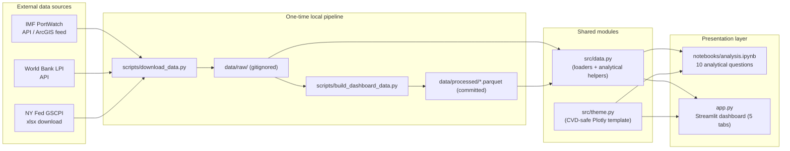

# Global Supply Chain Performance Dashboard

### When the World's Shipping Lanes Narrowed

**A data-visualization study of global supply chain performance, 2019–2026**

> Between late 2023 and 2024, two of the four critical passages in global
> maritime trade constricted at the same time — the Red Sea to conflict, the
> Panama Canal to drought. Using daily satellite AIS signals from ~90,000
> vessels, this project shows that global trade volume barely fell. What
> changed was the **routing** — and the ports and economies that absorbed the
> shift were not randomly distributed.

**[→ Live dashboard](https://YOUR-APP.streamlit.app)** · **[→ Analysis notebook](notebooks/analysis.ipynb)**

---

## Project Overview

This project analyses **IMF PortWatch**'s daily, satellite-derived record of
global maritime traffic to answer one question: when two of the world's four
critical shipping chokepoints narrowed at once — the Red Sea to conflict, the
Panama Canal to drought — did global trade actually shrink, or did it simply
move?

Ten multi-dimensional analytical questions are answered end-to-end, each with
its own publication-ready Plotly figure, and the same analysis is packaged
into a curated, interactive Streamlit dashboard. The through-line: **the
disruption changed *where* trade moved far more than *how much* moved, and the
ports and economies that absorbed the shift were not randomly distributed.**

Built for the Data Visualization course, Summer 2026.

---

## System Architecture

The project is split into a one-time data pipeline and two presentation
layers that both read from the same processed data and the same shared
analytical/visual modules — so the notebook and the dashboard can never drift
out of sync with each other.



**Why the split matters:** the raw daily ports table is ~650 MB — past
GitHub's 100 MB per-file limit and far beyond what Streamlit Community
Cloud's ~1 GB of RAM can hold. `build_dashboard_data.py` pre-aggregates it
into a handful of small parquet files that the dashboard reads instead, so
the repo stays lean and the deployed app loads in seconds.

---

## Features

- **10 multi-dimensional analytical questions**, each answered with its own
  takeaway-titled Plotly figure — comparisons across time, geography, cargo
  type, and economic indicators, not single-column value counts
- **Five-tab interactive Streamlit dashboard** — Global pulse, Chokepoints,
  Ports, Resilience, and Method & sources — each with independent, meaningful
  interactivity, not a restatement of one chart
- **Live cross-filtering**: date range, cargo type, smoothing window, and
  event-band toggle apply across every chart on every tab
- **CVD-safe design system** (`src/theme.py`) shared by every figure in the
  project — one Plotly template, one palette, enforced centrally
- **Reproducible data pipeline** — one command rebuilds the entire raw
  dataset (primary + both secondary sources) from public APIs; a second
  rebuilds the dashboard's aggregates
- **Honest analysis** — findings are reported as observed, including two
  results that came back null/weak and one that overturned the working
  hypothesis, rather than forcing a tidy narrative

---

## Technologies Used

| Layer | Technology |
| --- | --- |
| Language | Python 3.11 |
| Visualization | Plotly (`plotly.express`, `plotly.graph_objects`) |
| Dashboard | Streamlit |
| Data wrangling | pandas, NumPy |
| Storage format | Apache Parquet (via PyArrow, zstd-compressed) |
| Statistics | statsmodels (OLS trendline) |
| Notebook | Jupyter, nbformat, nbconvert/nbclient |
| Data access | requests (REST/ArcGIS), openpyxl / xlrd (Excel) |
| Data sources | IMF PortWatch, World Bank LPI, NY Fed GSCPI |

---

## Project Structure

```
supply-chain-dashboard/
├── app.py                        # Streamlit dashboard (5 tabs)
├── requirements.txt
├── LICENSE                       # MIT
├── PROJECT_PLAN.md               # the ten questions + reasoning + schedule
├── README.md
├── notebooks/
│   ├── analysis.ipynb            # EDA + 10 analytical questions, fully executed
│   ├── analysis.html             # HTML export (fully interactive charts)
│   └── analysis.pdf              # PDF export
├── presentation/
│   ├── deck.html / deck.pdf      # slide deck: visuals, insights, conclusions
│   ├── charts/                   # static chart crops used in the deck
│   └── snapshots/                # dashboard tab screenshots used in the deck
├── src/
│   ├── theme.py                  # CVD-safe Plotly template + helpers
│   └── data.py                   # loaders + analytical functions
├── scripts/
│   ├── download_data.py          # fetch raw data: PortWatch + LPI + GSCPI
│   └── build_dashboard_data.py   # raw CSV -> small parquet aggregates
└── data/
    ├── raw/                      # gitignored, rebuild with the script
    └── processed/                # committed, what the app reads
```

---

## Installation

**1. Clone and open the folder**

```bash
git clone <this-repo-url>
cd supply-chain-dashboard
```

**2. Create a virtual environment**

```bash
python -m venv .venv
```

Windows:
```bash
.venv\Scripts\activate
```

macOS / Linux:
```bash
source .venv/bin/activate
```

**3. Install dependencies**

```bash
pip install -r requirements.txt
```

**4. Download the data**

Pulls the primary IMF PortWatch tables plus the two secondary sources (World
Bank LPI, NY Fed GSCPI) used in Q7 and Q10. The ports file is large (~650 MB)
— start it and go make coffee.

```bash
python scripts/download_data.py
```

**5. Build the dashboard aggregates**

```bash
python scripts/build_dashboard_data.py
```

**6. Run**

```bash
streamlit run app.py
```

and open `notebooks/analysis.ipynb` in Jupyter or VS Code to explore the full
analysis. To re-run it end-to-end from the command line:

```bash
jupyter nbconvert --to notebook --execute --inplace notebooks/analysis.ipynb
```

**Recommended VS Code extensions:** Python, Jupyter, Ruff.

### Deploying to Streamlit Community Cloud

1. Push this repo to GitHub as a **public** repository. Confirm
   `data/processed/*.parquet` is committed — `.gitignore` excludes
   `data/raw/` but keeps `data/processed/`:
   ```bash
   git add -f data/processed
   git status          # verify the parquet files are staged
   ```
2. Go to [share.streamlit.io](https://share.streamlit.io) and sign in with GitHub.
3. **New app** → select this repo → branch `main` → main file `app.py` → **Deploy**.
4. Paste the resulting URL at the top of this README and into your presentation.

---

## Benchmark Evaluation

Before trusting the dataset for analysis, the notebook's preliminary
exploration section runs a set of data-quality checks against the full
~5.6 million-row daily panel:

| Check | Result |
| --- | --- |
| Ports reporting per day (min / median / max) | 2,065 / 2,065 / 2,065 |
| Days with unusually thin port coverage | 0 out of the full 2019–2026 record |
| Rows where cargo-class components ≠ reported total | 0 of 5,631,255 |
| Date coverage | 2019-01-01 → 2026-06-19, no gaps |

The panel is complete and internally consistent — every port reports every
day, and the cargo-type breakdown always reconciles to the reported total.
That gives confidence that later findings reflect real signal in the AIS
record rather than data-quality artifacts, and it is why the analysis can
treat gaps or dips in later charts as genuine events rather than missing
data.

---

## Experimental Results

Condensed findings from the ten analytical questions (full reasoning and
figures in [`notebooks/analysis.ipynb`](notebooks/analysis.ipynb)):

1. **Suez / Bab el-Mandeb collapse** — transits fell 62% and 76% respectively
   from baseline and were still running at roughly half their pre-crisis
   level in the most recent data.
2. **Cargo types reacted unevenly** — Ro-Ro (vehicle carrier) traffic fell
   hardest (-93%), overturning the working hypothesis that container traffic
   would flee first; general cargo fell least (-40%).
3. **Volatility is a mix of geopolitics and thin traffic** — Kerch Strait and
   the Cape of Good Hope's volatility map to real conflict/disruption;
   Magellan Strait's high variability is a low-traffic statistical artifact.
4. **The two main reroute alternatives narrowed together** — Panama and the
   Red Sea/Cape corridor were both constrained for a 6.5-month overlap.
5. **Winners and losers are geographically coherent** — Red Sea-facing ports
   (King Abdullah, Aqaba, Jeddah) lost 37–81% of container traffic; Eastern
   Mediterranean ports gained.
6. **Concentration held flat** — the top 20 ports' share of global container
   calls stayed in a 29–31% band from 2019 to 2026; a null result on the
   trend question, contrary to the initial "rising fragility" hypothesis.
7. **Logistics quality only weakly predicts recovery speed** — r = 0.39
   across 17 matched countries, with Singapore (highest LPI, slowest
   recovery) the clear outlier.
8. **Import-dependence cleanly separates two economy types** — small island
   states/coastal economies at 93–97% import-dependence versus commodity
   exporters (Kazakhstan, Russia, Australia) at 5–9%.
9. **No meaningful weekday-rhythm difference** — global hubs and
   regional/domestic ports swing across the week by nearly the same amount
   (13 vs. 14.5 index points); another null result.
10. **GSCPI tracks the physical record only loosely** — best-fit lag of +6
    months, r = 0.25, too weak to claim either series reliably leads the
    other.

---

## Methodologies

All analytical logic lives in `src/data.py`, kept free of any Streamlit
import so the exact same functions serve both the notebook and the
dashboard:

- **Indexing to a baseline** (`index_to_baseline`) — rebases each chokepoint
  or cargo series to its own pre-crisis average = 100, so passages of very
  different absolute size (Suez vs. the Bosporus) are visually comparable.
- **Centred rolling smoothing** (`smooth`) — a 7–14 day centred mean removes
  the weekly port-operations cycle without shifting turning points the way a
  trailing mean would.
- **Coefficient of variation** (σ/μ) rather than raw standard deviation, so
  busy and quiet chokepoints can be ranked on the same scale.
- **Recovery half-life** (`recovery_half_life`) — days for a series to climb
  back to half its pre-shock gap; returns `NaN` (not silently dropped) when a
  series never recovers within the horizon, since that is itself a finding.
- **Herfindahl–Hirschman Index** (`herfindahl`) and top-20 share — standard
  concentration measures applied to port-level container traffic.
- **Lead–lag cross-correlation** — GSCPI shifted month-by-month against the
  standardised physical series to find the best-fitting lag.
- **Percentage change between windows** (`pct_change_between`) — compares
  two user- or analysis-chosen date ranges per group, filtered to a minimum
  baseline so very small ports don't produce meaningless swings.

Every figure is also routed through one shared Plotly template
(`src/theme.py`) implementing the course's design rules: the Okabe–Ito
CVD-safe palette, muted grey for context with a single highlight colour per
chart, no gridlines or chart junk, and titles that state the takeaway rather
than the axes.

---

## Limitations

- **PortWatch trade volumes are AIS-derived estimates, not customs data.**
  Port calls are observed vessel movements; import/export volumes are
  modelled from vessel type, capacity, and draft. All findings are framed as
  *relative change over time* for this reason.
- **Vessel counts are not capacity.** A shift toward fewer, larger ships
  would understate volume relative to transit counts.
- **Event dates are context, not data.** The shaded crisis windows are drawn
  from public reporting, not from the dataset itself.
- **Q7's correlation is drawn from a single shared shock and n = 17** — it
  cannot establish that logistics quality causes faster recovery, only that
  the two are weakly associated in this one episode.
- **Q8's exposure proxy is a documented modelling choice** (import share of
  total trade), not a measured chokepoint-routing assignment.
- **Q9's port classification is a constructed proxy** (top 20 by vessel
  traffic), since the live PortWatch reference table has no ready-made
  systemic-importance label.
- **Not yet deployed.** As of this writing the dashboard runs correctly
  locally but is not yet pushed to a public GitHub repository or deployed to
  Streamlit Community Cloud.

---

## Future Improvements

- Deploy the dashboard to Streamlit Community Cloud and replace the
  placeholder link at the top of this README
- Build the presentation deck (slides + dashboard snapshots, exported to PDF)
- Replace Q8's import-share proxy with an actual geographic routing
  assignment per chokepoint
- Extend the LPI join to a multi-year panel instead of a single most-recent
  year, to test whether the Q7 relationship holds across shocks, not just one
- Add automated tests around the analytical helpers in `src/data.py`
  (baseline indexing, HHI, recovery half-life) and a CI job that re-executes
  the notebook on push
- Add a country/region selector to the dashboard's "Resilience" tab so the
  concentration and exposure views can be explored below the global level

---

## Data

**[IMF PortWatch](https://portwatch.imf.org/)** — daily port-call and
trade-volume estimates for **2,065 ports** and daily transit counts for **28
major chokepoints**, derived from satellite AIS signals broadcast by roughly
90,000 vessels. Published by the International Monetary Fund, updated weekly.

| Type | Columns |
|---|---|
| Temporal | `date`, `year`, `month`, `day` — daily, 2019 → present |
| Spatial | port coordinates, `country`, `ISO3`, 28 named chokepoints |
| Categorical | five cargo classes; systemic-importance classification |
| Numerical | port calls, import/export volume, transit capacity |

**Secondary sources** (joined where noted in the notebook):

- [World Bank Logistics Performance Index](https://lpi.worldbank.org/) — logistics quality per country
- [NY Fed Global Supply Chain Pressure Index](https://www.newyorkfed.org/research/policy/gscpi) — monthly composite index

---

## Attribution

Data: **IMF PortWatch**, International Monetary Fund —
[portwatch.imf.org](https://portwatch.imf.org/). Supplementary data from the
World Bank and the Federal Reserve Bank of New York.

Built for Data Visualization, Summer 2026.

---

## License

Licensed under the **MIT License** — see [`LICENSE`](LICENSE).

## Author

**Yashu Bopanna Pasura Devaiah**
